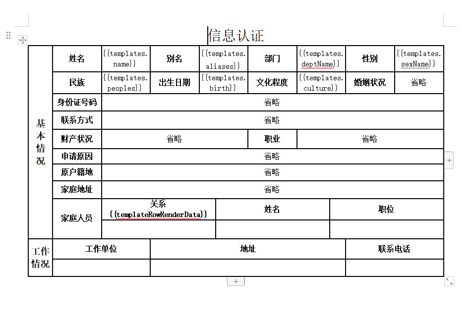
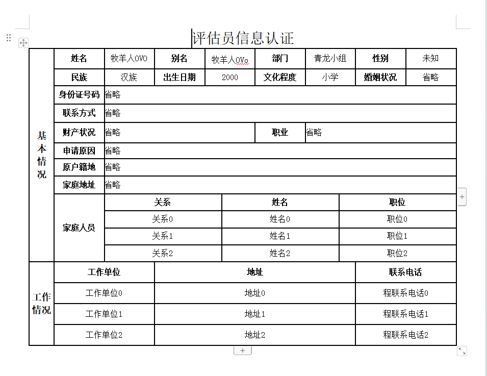

# java实现word文档动态表格复杂操作

## 项目介绍
* 目的：主要为了实现表格动态横竖合并等操作
* 实现过程：定义一个类TemplateTableRenderPolicy继承DynamicTableRenderPolicy类插件重写方法实现动态渲染表格
* 详细记录了每一步操作，图文结合，可以更好的理解这个渲染插件的原理。
* poi-tl依赖是当前最新的(version 1.12.1)、如果版本不一样，没关系，原理是一样的。新版看懂了，旧版也照猫画虎就可以了。而且旧版的话、更容易使用，新版太规范了

## 前后对比
* 渲染前

* 渲染后

#### 操作
1. git clone 项目地址
2. 初始化项目
3. 打开测试类PoiDemoApplicationTests
4. 执行即可
